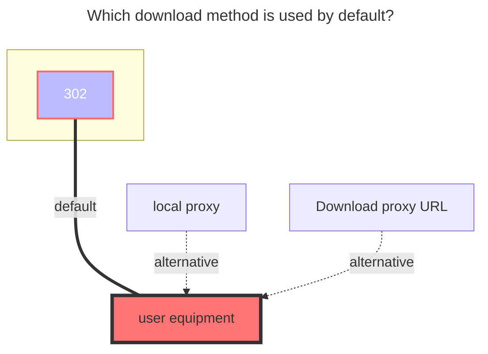
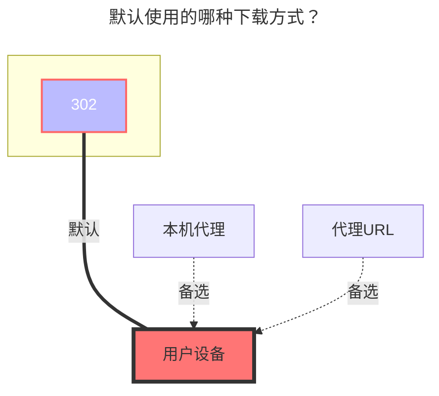

---
title:
  en: Aliyun PDS
  zh-CN: 阿里云 PDS
icon: iconfont icon-state
# This control sidebar order
top: 700
# A page can have multiple categories
categories:
  - guide
  - drivers
# A page can have multiple tags
tag:
  - Storage
  - Guide
  - '302'
  - '官方'
sticky: true
star: true
---

<!--@include: @/snippets/tos-tip.md-->

::: en
::: tip
Aliyun PDS is mounted through the official PDS API. It is different from the personal AliyunDrive Open driver and requires a PDS `domain_id` and `drive_id`.
:::
::: zh-CN
::: tip
阿里云 PDS 使用官方 PDS API 挂载，和个人阿里云盘 Open 驱动不是同一个服务，需要填写 PDS 的 `domain_id` 与 `drive_id`。
:::

## 1. Preparation { lang="en" }

## 1. 准备工作 { lang="zh-CN" }

::: en

You need a usable Aliyun PDS domain and an account that can authorize access to the target drive.

- `Domain ID`: the subdomain part of the PDS API endpoint. For example, if the API endpoint is `https://example.api.aliyunfile.com`, the domain ID is `example`.
- `Drive ID`: the target drive ID under the PDS domain.
- `Client ID`: OAuth client ID. If you do not have a custom one, keep the default value `lMNVp25Sd1MfqZDQ`.

:::

::: zh-CN

你需要一个可用的阿里云 PDS 域，以及一个可以授权访问目标 Drive 的账号。

- `Domain ID`：PDS API 端点中的子域名部分。例如 API 端点是 `https://example.api.aliyunfile.com`，则 Domain ID 为 `example`。
- `Drive ID`：PDS 域下需要挂载的目标 Drive ID。
- `Client ID`：OAuth 客户端 ID。如果没有自定义客户端，保持默认值 `lMNVp25Sd1MfqZDQ` 即可。

:::

::: en
::: warning
`access_token` is short-lived. It is recommended to configure `refresh_token` so that OpenList can refresh and save the token automatically.
:::
::: zh-CN
::: warning
`access_token` 是短期令牌，建议配置 `refresh_token`，这样 OpenList 可以自动刷新并保存新的令牌。
:::

## 2. Get Tokens { lang="en" }

## 2. 获取令牌 { lang="zh-CN" }

::: en

1. Open <https://api.oplist.org>.

2. Select `Aliyun PDS (OAuth2) Login` in the driver drop-down list.

3. Fill in `PDS Domain ID`.

4. Keep `Client ID` as the default value `lMNVp25Sd1MfqZDQ`, unless you have your own OAuth client ID.

5. Click `Get Token`. The page will request a device authorization code and show the authorization URL.

6. Click `Open Authorization Page`, complete authorization in the opened page, and wait for the token page to finish polling.

7. After authorization succeeds, the page will fill in `Access Token`, `Refresh Token`, `Token Type`, and `Expires At`.

8. Click `List Drive`, select the drive you want to mount, and then click `Generate Config`. Copy the generated values to the OpenList storage configuration.

:::

::: zh-CN

1. 打开 <https://api.oplist.org>。

2. 在网盘类型下拉框中选择 `Aliyun PDS (OAuth2) 跳转登录`。

3. 填写 `PDS Domain ID`。

4. `Client ID` 保持默认值 `lMNVp25Sd1MfqZDQ` 即可，除非你有自己的 OAuth 客户端 ID。

5. 点击 `获取 Token`，页面会申请设备授权码并显示授权链接。

6. 点击 `打开授权页面`，在打开的页面中完成授权，然后等待令牌页面轮询完成。

7. 授权成功后，页面会自动填写 `Access Token`、`Refresh Token`、`Token Type` 和 `Expires At`。

8. 点击 `列出 Drive`，选择需要挂载的 Drive，再点击 `生成配置`。将生成的配置值复制到 OpenList 的存储配置中。

:::

## 3. Add in OpenList { lang="en" }

## 3. 在 OpenList 中添加 { lang="zh-CN" }

::: en

1. Open the OpenList management page and go to `Storage`.

2. Click `Add Storage`.

3. Select the `PDS` driver.

4. Fill in the mount path, such as `/pds`.

5. Fill in the following fields according to the token page output.

:::

::: zh-CN

1. 打开 OpenList 管理页面，进入 `存储`。

2. 点击 `添加存储`。

3. 驱动选择 `PDS`。

4. 填写挂载路径，例如 `/pds`。

5. 按照令牌获取页面生成的内容填写下面的字段。

:::

### Root Folder ID { lang="en" }

### 根文件夹 ID { lang="zh-CN" }

::: en
Default: `root`.

If you want to mount only a specific folder, fill in that folder's `file_id`.
:::

::: zh-CN
默认为 `root`。

如果只想挂载某个文件夹，请填写该文件夹的 `file_id`。
:::

### Domain ID { lang="en" }

### Domain ID { lang="zh-CN" }

::: en
Fill in the PDS domain ID used when obtaining the token, such as `example` in `https://example.api.aliyunfile.com`.
:::

::: zh-CN
填写获取令牌时使用的 PDS Domain ID，例如 `https://example.api.aliyunfile.com` 中的 `example`。
:::

### Drive ID { lang="en" }

### Drive ID { lang="zh-CN" }

::: en
Fill in the target drive ID. You can obtain it by clicking `List Drive` on the token page.
:::

::: zh-CN
填写目标 Drive ID，可以通过令牌页面的 `列出 Drive` 获取。
:::

### Client ID { lang="en" }

### Client ID { lang="zh-CN" }

::: en
Default: `lMNVp25Sd1MfqZDQ`.

If you used a custom OAuth client ID to obtain the token, fill in the same client ID here.
:::

::: zh-CN
默认为 `lMNVp25Sd1MfqZDQ`。

如果获取令牌时使用了自定义 OAuth 客户端 ID，这里也需要填写同一个 Client ID。
:::

### Access Token { lang="en" }

### Access Token { lang="zh-CN" }

::: en
Short-lived PDS access token. If `refresh_token` is configured, this field can be left empty and OpenList will refresh it on the first request.
:::

::: zh-CN
PDS 短期访问令牌。如果已经配置 `refresh_token`，此项可以留空，OpenList 会在首次请求时自动刷新。
:::

### Refresh Token { lang="en" }

### Refresh Token { lang="zh-CN" }

::: en
Recommended. OpenList uses this token to automatically refresh `access_token` and persist the new token information.
:::

::: zh-CN
推荐填写。OpenList 会使用该令牌自动刷新 `access_token`，并保存新的令牌信息。
:::

### Token Type { lang="en" }

### Token Type { lang="zh-CN" }

::: en
Usually `Bearer`. Keep the value returned by the token page.
:::

::: zh-CN
通常为 `Bearer`，保持令牌页面返回的值即可。
:::

### Expires At { lang="en" }

### Expires At { lang="zh-CN" }

::: en
Unix timestamp in seconds. Highly recommand fill in `0`; when `refresh_token` exists, OpenList will refresh the token when needed.
:::

::: zh-CN
单位为秒的 Unix 时间戳。强烈建议填写 `0`；存在 `refresh_token` 时，OpenList 会在需要时刷新令牌。
:::

## 4. Supported Operations { lang="en" }

## 4. 支持的操作 { lang="zh-CN" }

::: en

- List files and folders
- Download through direct links
- Upload files
- Create folders
- Rename files and folders
- Move files and folders
- Copy files and folders
- Delete files and folders to the PDS recycle bin
- Read drive usage details
- Refresh OAuth tokens automatically when `refresh_token` is configured

:::

::: zh-CN

- 列出文件和文件夹
- 通过直链下载
- 上传文件
- 新建文件夹
- 重命名文件和文件夹
- 移动文件和文件夹
- 复制文件和文件夹
- 删除文件和文件夹到 PDS 回收站
- 读取 Drive 容量信息
- 配置 `refresh_token` 后自动刷新 OAuth 令牌

:::

## 5. Notes { lang="en" }

## 5. 注意事项 { lang="zh-CN" }

::: en

- Delete operations move objects to the PDS recycle bin instead of permanently deleting them.
- Upload currently uses one-part upload. Very large files may be limited by the PDS API, network, or deployment environment.
- Do not expose `access_token` or `refresh_token`. If a token is leaked, revoke the authorization from the PDS side and obtain a new token.
- The default client ID is a public OAuth client ID. It is not a secret. If your PDS domain requires a dedicated application, use your own client ID.

:::

::: zh-CN

- 删除操作会将对象移动到 PDS 回收站，并不是永久删除。
- 当前上传使用单分片上传，超大文件可能受 PDS API、网络或部署环境限制。
- 请勿泄露 `access_token` 或 `refresh_token`。如果令牌泄露，请在 PDS 侧解除授权后重新获取令牌。
- 默认 Client ID 是公开 OAuth 客户端 ID，并不是密钥。如果你的 PDS 域要求专用应用，请使用自己的 Client ID。

:::

## 6. Default Download Method { lang="en" }

## 6. 默认使用的下载方式 { lang="zh-CN" }

::: en

:::
::: zh-CN

:::
